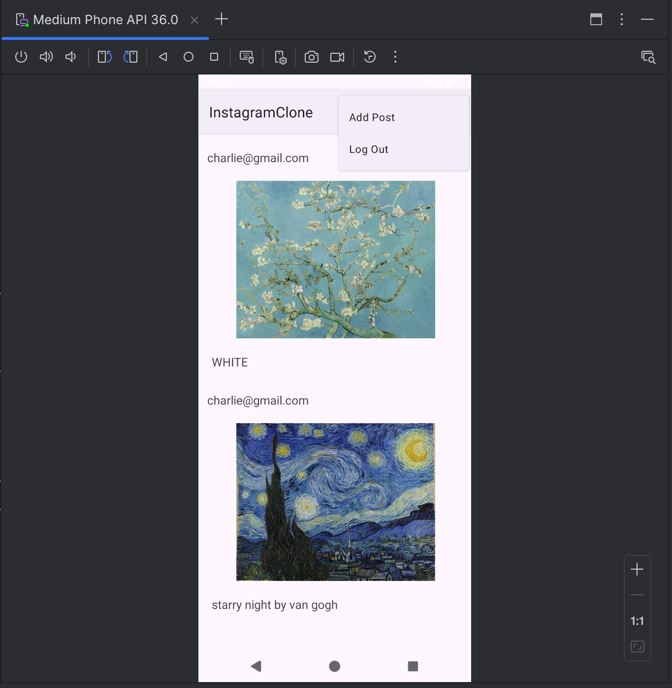
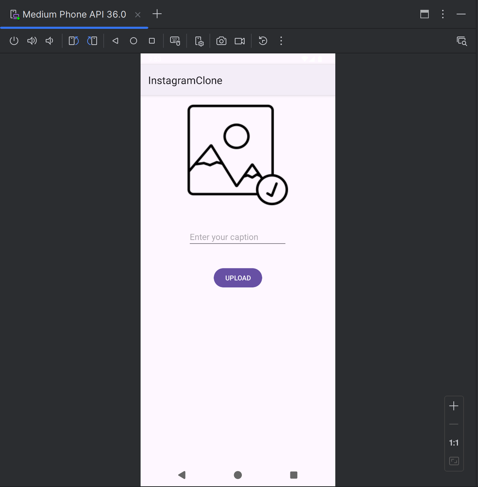
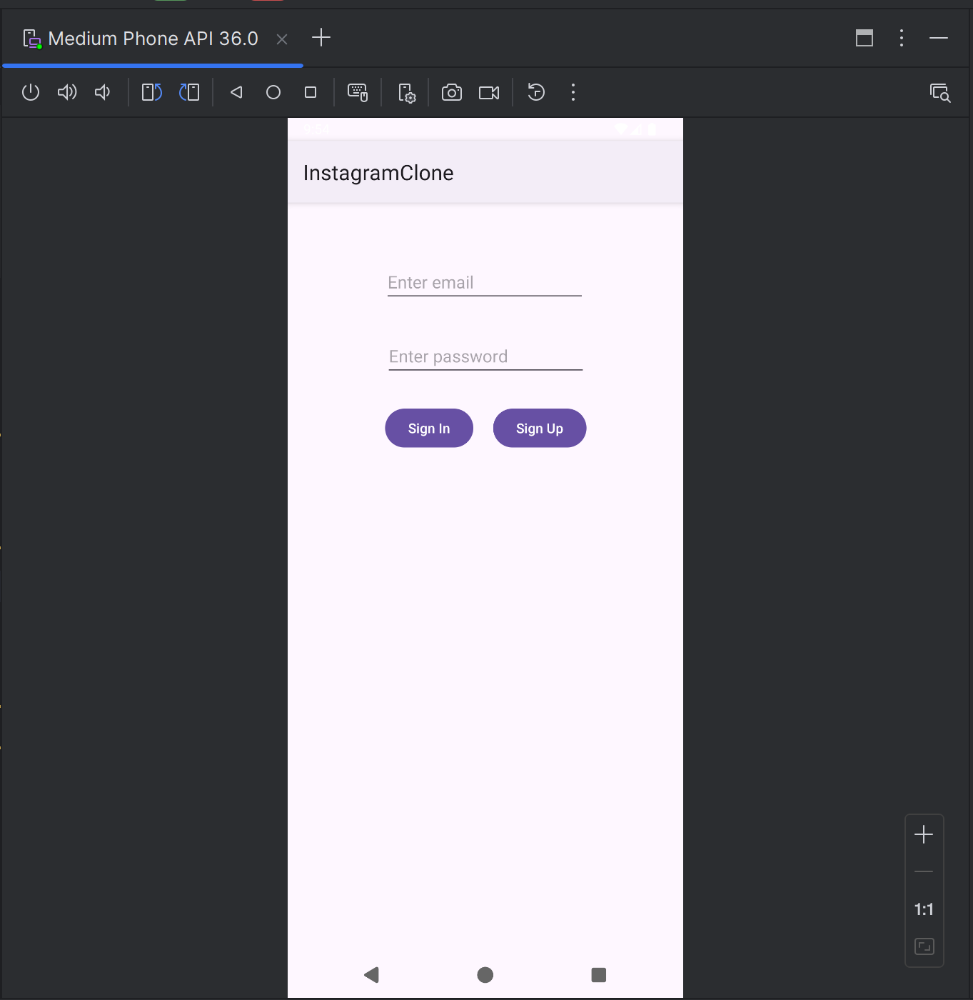

# 📷 Instagram Clone

This project is a simple Instagram clone built using Firebase. Users can sign in, share images with captions, and view posts shared by others in a feed.

## 🚀 Features

- 🔐 Firebase Authentication (Sign up / Log in)
- 📸 Image upload and sharing
- 📝 Caption support
- 📰 Real-time feed sorted by post date
- ☁️ Firebase Firestore and Storage integration

---

## 📱 Screenshots

Feed Page | Upload Page | Login Page
:-------------------------:|:-------------------------:|:-------------------------:
 |  | 

> 📁 Be sure to add a `screenshots` folder to your repository and place your screenshots there.

## 🛠 Technologies Used

- Java (Android)
- Firebase Authentication
- Firebase Firestore
- Firebase Storage

